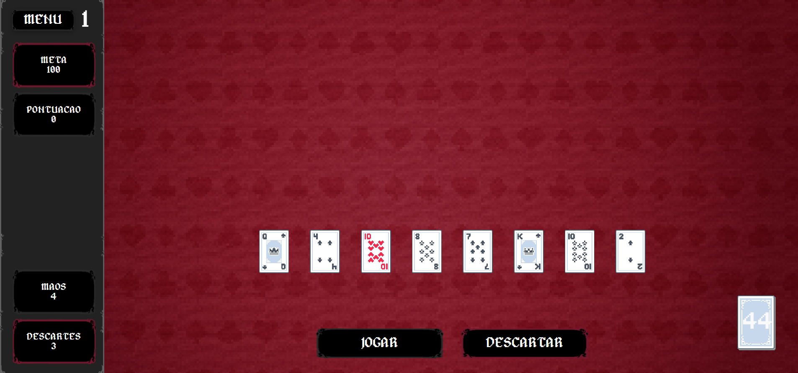

# Cardstlevania

## 1. Título do projeto
**Cardstlevania** - jogo de cartas em TypeScript inspirado em mecânicas de poker por rodadas.

## 2. Descrição breve do projeto
Cardstlevania é um jogo web no qual o jogador seleciona cartas da mão para formar combinações de poker e atingir metas de pontuação por rodada.
Cada jogada considera a melhor combinação possível entre as cartas selecionadas, com cálculo de pontuação baseado no tipo da mão e no valor das cartas.
O projeto foi desenvolvido com TypeScript Vanilla, Vite e Web Components, com foco em lógica de jogo + interface interativa no navegador.

## 3. Demonstração / objetivo do projeto
### Objetivo
Construir uma experiência jogável de cartas no navegador, aplicando conceitos de lógica, estado de jogo, manipulação de DOM e componentização com Web Components.

### Fluxo da partida
1. O jogador inicia com 8 cartas na mão.
2. Seleciona até 5 cartas para jogar ou descartar.
3. A melhor combinação é avaliada (Par, Trinca, Sequência, Flush, Full House, etc.).
4. A pontuação é somada até atingir a meta da rodada.
5. Ao cumprir a meta, o jogo avança para a próxima rodada com dificuldade maior.

### Demonstração visual (interface)



## 4. Tecnologias utilizadas
- **TypeScript (Vanilla)**
- **Vite** (dev server e build)
- **Web Components** (componente customizado de carta)
- **HTML5 + CSS3**
- **Vitest** (configurado no projeto)
- **Assets multimídia**: imagens, efeitos sonoros e músicas

## 5. Funcionalidades principais
- Geração e embaralhamento de baralho completo (52 cartas).
- Compra inicial de 8 cartas para a mão do jogador.
- Seleção interativa de cartas com limite de até 5 por ação.
- Avaliação de mãos de poker (Carta Alta, Par, Dois Pares, Trinca, Sequência, Flush, Full House, Quadra, Straight Flush, Royal Flush e Flush House).
- Cálculo de pontuação por raridade da mão + soma dos valores das cartas + multiplicador por rodada.
- Sistema de jogadas e descartes limitados por rodada.
- Progressão por metas com transição de rodada e reinicialização de estado.
- Modal de derrota quando a meta não é atingida.
- Pré-visualização em tempo real da mão selecionada e pontuação estimada.
- Música de fundo contextual (menu/partida), efeito sonoro de ação e cursor customizado.

## 6. Como executar o projeto localmente
### Pré-requisitos
- Node.js 18+ (recomendado)
- npm

### Passo a passo
```bash
git clone https://github.com/<seu-usuario>/ufjf-dcc206-2025-1-a-trb-canastra.git
cd ufjf-dcc206-2025-1-a-trb-canastra
npm install
npm run dev
```

Depois, abra no navegador o endereço exibido no terminal (geralmente `http://localhost:5173`).

### Comandos úteis
```bash
# gerar build de produção
npm run build

# visualizar build localmente
npm run preview

# executar testes (quando houver)
npm run test
```

## 7. Estrutura do projeto
```text
.
|- index.html                 # Tela inicial (menu)
|- partida.html               # Tela principal de jogo
|- tutorial.html              # Tela de tutorial/regras
|- src/
|  |- main.ts                 # Ponto de entrada e inicialização geral
|  |- components/
|  |  |- carta-component.ts   # Web Component da carta (seleção/animação)
|  |- Importados/
|  |  |- jogo.ts              # Estado da partida, jogadas, descartes e progressão
|  |  |- avaliador.ts         # Avaliação de mãos e cálculo de pontuação
|  |  |- interface.ts         # Renderização e atualização de HUD/modais
|  |  |- carta_baralho.ts     # Modelos de carta e operações de baralho
|  |  |- musica.ts            # Controle de música/efeitos
|  |  |- assets importacao/   # Mapeamento de imagens, cursores e áudio
|  |- estilos/                # CSS modular por área da interface
|  |- recursos/               # Assets visuais e sonoros do projeto
```

## 8. Aprendizados e conceitos aplicados
- Modelagem de domínio de cartas usando tipos literais e classes em TypeScript.
- Organização da lógica em módulos independentes (baralho, avaliação, interface e áudio).
- Implementação de Web Components com Shadow DOM para encapsular comportamento visual das cartas.
- Manipulação de estado de jogo em tempo real com atualização reativa da interface.
- Criação de fluxo completo de gameplay com progressão de dificuldade por rodadas.
- Integração de experiência audiovisual (música, efeitos e cursor temático) para reforçar identidade do jogo.

---

Projeto acadêmico desenvolvido para a disciplina de Desenvolvimento Web (UFJF), com foco em aplicação prática de TypeScript, arquitetura modular e experiência interativa no navegador.
